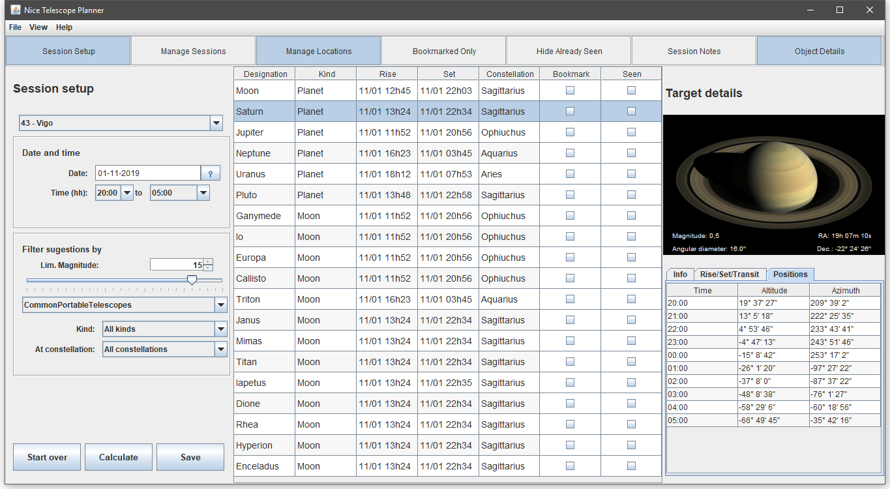
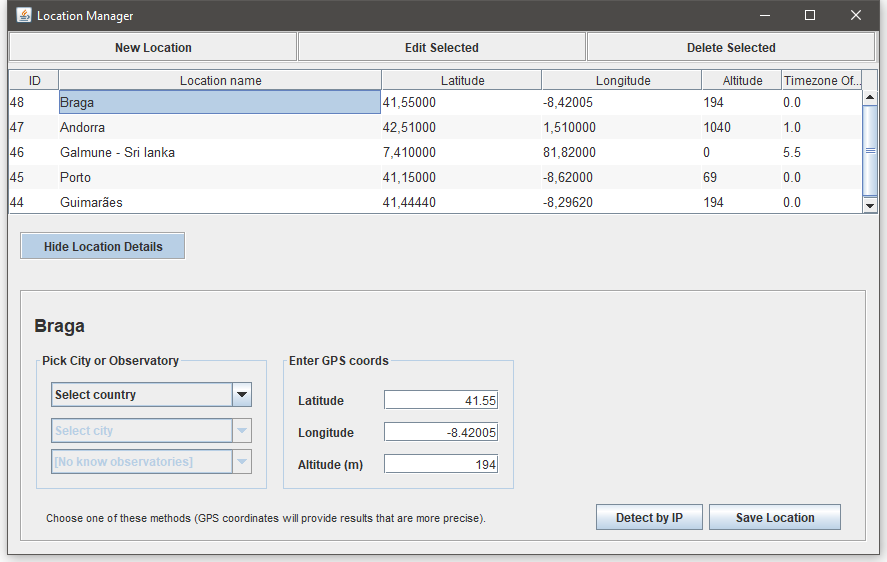

# Nice Telescope Planner

A simple cross-platform desktop utility for amateur astronomy hobbyists, written in Java. The aim is to provide an easy to use tool to help planning sky observation sessions, suggesting some of the interesting objects you may be able to watch at naked eye, or using amateur equipment (binoculars or small to medium size telescopes) in a given date/time and place.

## How to use
The first step is to define your first observatory, using the Location Manager. Click the "Manage Locations" button, which can be found in the main window toolbar.

### 1. Insert your first location
Then, insert the GPS coordinates of the place where you will be watching the sky. In case you don't know your coordinates, you may still use some alternative methods. The easiest one is to allow the computer to estimate your approximate position based on the IP address (it makes a request to IP-API.com). However, it will often detect the wrong city, so you may be better served by one of the other options. 

You can also select a country from the combobox on the left side and then either pick a city or a know observatory. Please notice that you can't select observatories based on a specific city, though. As soon as you pick a city or an observatory, the Latitude and Longitude text fields will be filled up with the corresponding values. 

Click *Save* and enter a name for the new location you are saving. 

### 2. Define a new session for one of your locations
Go back to the main window and pick a **location** from the combobox. For your convenience, it will automatically select the most recently entered location. Select the **date** when you will be observing the sky, as well as the **start and end times** for that session.

### 3. Define filters or constraints (optional)
By default, there is only one contraint, the **Limiting Magnitude**, which is preset to 15 (an average value that will show only space objects that can be seen using the most common amateur telescopes). The limiting magnitude may be set using the horizontal slider or the spin text box. 

There are a few other useful presets you can pick from the combobox, that will apply predefined limiting magnitude values. For instance, you may want to plan a session with binoculars, or with naked eye settings. 

In case you're still not familiar with the concept of limiting magnitude, it basically determines the faintest star that you will be able to see at naked eye or with a telescope. A higher numerical value will include mode space objects in the central table, including those that are harder to watch from Earth. A lower numerical value will only include brighter targets.

You may also filter by kind and by constelation. However, at this time, it won't be very useful, since this application does not include deep space objects yet. So, in fact there is no urging need to filter through a large number of targets.

### Press Calculate to get some interesting data!

Press calculate and let the computer generate a list of targets that will be above the horizon during that session. If you click on one item of the list, the right panel shows some details about that object, like the hourly altitudes and azimuths, rise, transit and set times, and more.

## Installation and dependencies

At this time, this application is still under development and requires a MySQL database server. The database must be manually created, for instance by "forward engineering" the provided file (`docs/EER_diagram.mwb`) using MySQL Workbench. 

This application integrates a few useful third-party libraries that are essential for its operation and must be loaded into NetBeans or your prefered IDE:

- [JPARSEC](http://conga.oan.es/~alonso/doku.php?id=jparsec), a comprehensive astronomy library written in Java, by Tomás Alonso Albi, as well as all of its dependencies.

- [LatLongToTimezone](https://github.com/drtimcooper/LatLongToTimezone), a latitude/longitude to timezone mapper, by Tim Cooper.

- [Gson](https://github.com/google/gson), a serialization/deserialization library to convert Java Objects into JSON and back.

- MySQL Java Connector

- SwingX, a set of GUI components that extend Swing.

The "Detect By IP" feature works by issuing a basic HTTP request to a JSON web API at http://ip-api.com.

## Did you find a bug or do you want to contribute?

Please let me know, by opening a new issue or a pull request.
